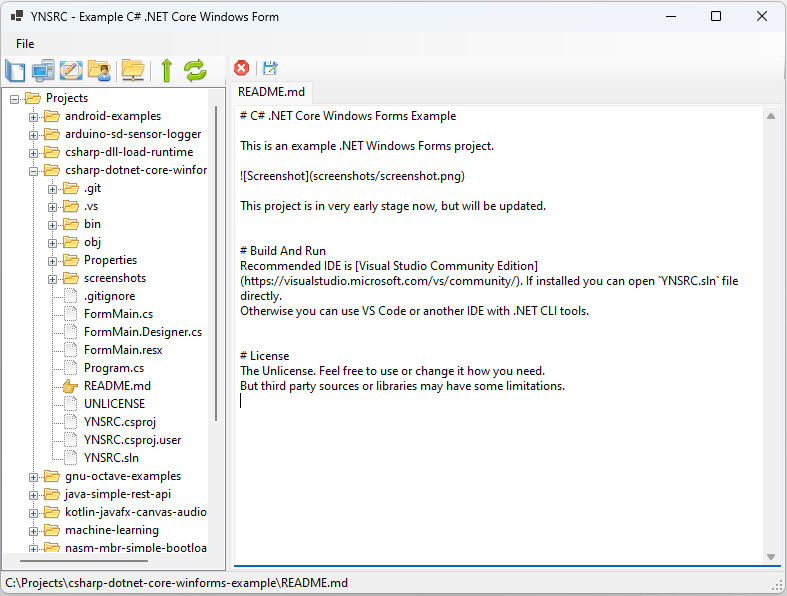

# C# .NET Core Windows Forms Example

This is an example .NET Windows Forms project.

This project is in very early stage now, but will be updated.

# Build And Run
Recommended IDE ise [Visual Studio Community Edition](https://visualstudio.microsoft.com/vs/community/). If installed you can open `YNSRC.sln` file directly.
Otherwise you can use VS Code or another IDE with .NET CLI tools.

# License
The Unlicense. Feel free to use or change it how you need.
But third party sources or libraries may have some limitations.
